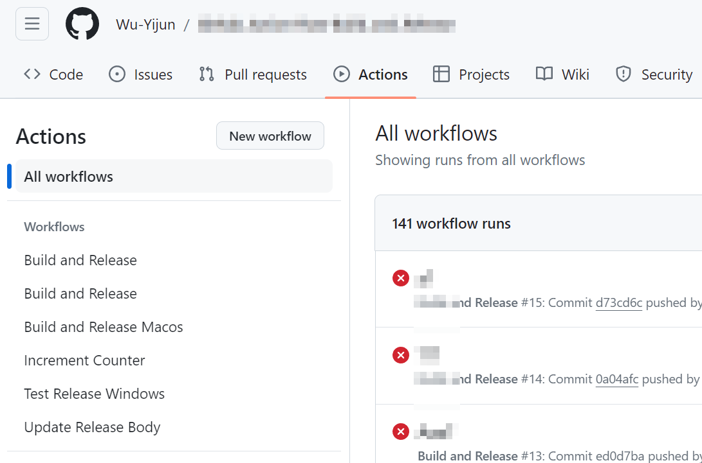
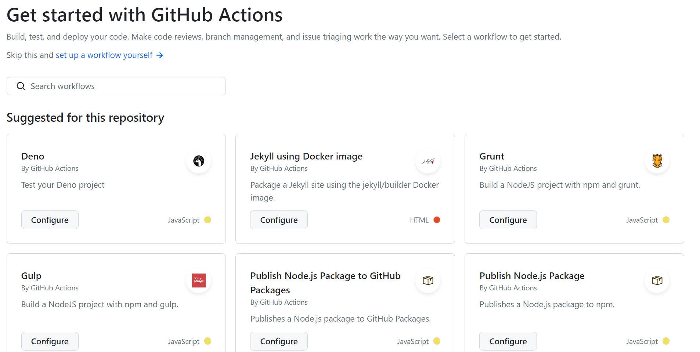

# 关于 Github Action 的一份不完全指南

镇楼

~~其实是因为发贴时不能预览~~

---

目录

- 介绍
- 基本用法

---

## Github Action 能干什么
 
*ChatGPT 是这样说的.*

GitHub Actions 是一个功能强大的自动化工具，可以帮助开发人员自动化软件开发工作流程中的各种任务。它可以执行各种操作，包括但不限于：

1. **持续集成**: 在每次代码提交或 Pull Request 提交时自动运行测试，确保代码质量。
2. **持续部署 (CD)**: 将代码部署到测试环境或生产环境，以自动化发布过程。
3. **自动化代码质量检查**: 运行静态代码分析工具、代码风格检查工具和安全漏洞扫描工具，以确保代码质量和安全性。
4. **自动化文档生成**: 从代码中生成文档，并将其发布到指定位置，如 GitHub Pages。
5. **通知和警报**: 通过邮件、Slack 或其他渠道发送通知和警报，以便及时响应事件。
6. **版本控制和自动发布**: 根据版本标签或其他条件自动发布软件包、库或应用程序。

自定义任务和工作流程：根据项目需求，执行各种自定义任务和工作流程，以满足特定的开发和部署需求。
总的来说，GitHub Actions 可以帮助简化开发流程，提高开发团队的效率，减少手动操作，降低出错的可能性，并加速软件的交付速度。

我看来, Github Action 就是 Github 提供的一个**云服务器,** 可以访问你的库, 下载依赖或其它程序, 运行脚本或程序, 最后还可以利用 GitHub REST API 进行各种库的操作.

也就是说, 你可以白嫖 GitHub 的计算资源, 在云端进行一些计算.

由于 GitHub Action 的教程不多, 也没什么人会用, 很多人只会点出一个推荐配置, 然后就"能跑就行, 我也不知道我配了个啥"(毕竟我最开始就是这样的). 然后当我真正想用的时候, 却发现它的坑很多, 网上的教程也很少, 很多东西只能自己总结, 摸索.
前人踩了那么多坑, 既然踏出了一条羊肠小路, 那就为后人做点共享, 指一下方向也是好的.

因此, 这篇帖子的后面的部分给出了一个 Github Action 的从 0 到 1 的教程, 至于 二生三, 三生万物 的本事有没有, 那就看各位的造诣了.

## Github Action 怎么用

你将 YAML文件(.yml, .yaml) 扔到 ${workspaceRoot}/.github/workflows 下, Github 会自动检测到并且添加到 Actions 部分, 左下方 `all workflows` 下方的对应的就是你的各个YAML文件的工作流, 右侧是这些工作流每次运行的结果. **只有主分支创建的yaml文件会被收入工作流, 分支可以修改但是不能创建**


如果你没有 workflow 文件, GitHub 会根据你的项目, 自动推荐一些可能的工作流, 或者你也可以手动设置([Skip this and set up a workflow yourself](#github-action-怎么用))


## YAML 文件怎么写

yaml 文件的关键有两个部分触发器和工作流

触发器（triggers）定义了何时 GitHub 将运行 Action。
工作流定义了运行时执行什么工作.

#### 触发器

Trigger 可以有不同的方式, 具体包括:

1. **Push 触发器：** 当某人将代码推送到仓库时触发。可以根据分支和路径进行过滤。

```yaml
on:
  push:
    branches:
      - main
      - master
      - some-other-branches
    paths:
      - 'src/**'
      - 'paths/to/your/changed/files'
```

branches 过滤器告诉GitHub当你的哪一个分支提交时触发此工作流, branches 后紧跟着的就是分支的名称列表.

paths 路径过滤功能允许你指定只有在特定路径下的文件发生变化时才触发 GitHub Action。这对于大型仓库中只对特定目录或文件感兴趣的工作流程非常有用。
路径过滤是通过使用 paths 关键字实现的。你可以指定一个文件或一组文件的路径，也可以使用通配符模式匹配多个文件或目录。

这两个过滤器的条件合取作为push触发器的条件.

*疑问: 我希望在main分支的任何文件发生变化, 或是branchA分支的src/文件夹下文件发生改变时才触发, 该怎么设置触发器?*

2. **Pull Request 触发器：** 当有 Pull Request 被打开、更新或合并时触发。

```yaml
on:
  pull_request:
    types: [opened, synchronize, closed]
```

pull_request 触发器用于在 Pull Request 相关事件发生时触发 GitHub Actions。这些事件包括：

- Pull Request 被打开（opened）
- Pull Request 被更新（synchronize）
- Pull Request 被关闭（closed）

3. **定时触发器：** 按照设定的时间表触发 Action。可以是 cron 表达式。

```yaml
on:
  schedule:
    - cron: '0 0 * * *' # 每天 0 点触发
    - hourly            # 每小时触发一次
```

schedule 表示这是一个定时触发器, 后面跟着时间表项列表. 每个时间表项定义了触发 Action 的时间规则。它可以是 cron 表达式，也可以是简单的字符串。

**Cron 表达式**： Cron 表达式是一种灵活的时间表达方式，允许你按照分钟、小时、天、月、星期等单位来指定触发时间。例如，0 0 * * * 表示每天的零点触发，0 0 * * MON 表示每周一的零点触发。
**简单的字符串**： 除了 cron 表达式外，GitHub Actions 还支持一些预定义的字符串，比如 `every 5 minutes`, `every 30 minutes`, `every hour`, `hourly`, `daily`, `weekly` 等。


4. **仓库调度触发器：** 当 GitHub 启动了仓库的工作流程时触发。

```yaml
on:
  repository_dispatch:
    types: [my_event_type, other-event-types]
```

types 筛选了触发的类型列表, 如果略去则任意名称

要触发这个工作流程，你需要通过 GitHub API 发送一个 POST 请求。请求的内容应包含与 types 字段匹配的事件类型。例如，在命令行中可以使用 curl 发送类型为 my_event_type 的请求：

```Shell
curl \
  -X POST \
  -H "Authorization: token YOUR_GITHUB_TOKEN" \
  -H "Accept: application/vnd.github.everest-preview+json" \
  https://api.github.com/repos/$owner/$repo/dispatches \
  -d "{\"event_type\": \"$my_event_type\"}"
```

5. **外部触发器**: 手动触发 Action.

```yaml
on:
  workflow_dispatch:
    inputs:
      name-of-var:
        description: 'Description of this var'
        required: true
        default: 'default string'
      name-of-var-2:
        description: 'Description of this var2'
        required: false
```

workflow_dispatch 说明这是一个外部触发器, inputs 部分包含了需要输入的参数, required 规定了此参数是否是必须的, 而 default 给出了填充此参数的默认字符.